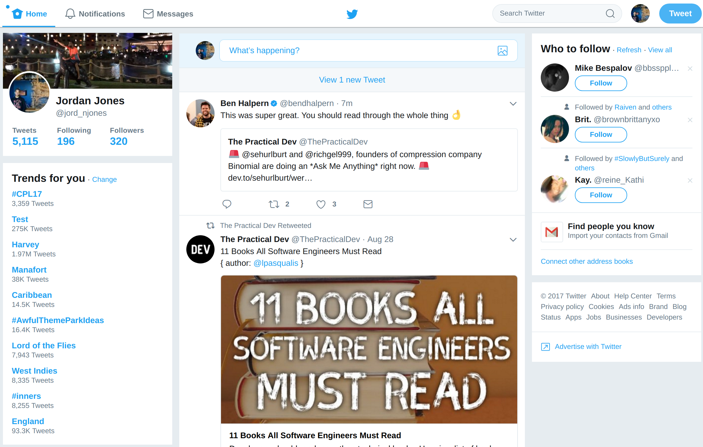

#  Lurk

> Twitter, for those who don't want to tweet.

## Why

I just want to see tweets from people I follow, the rest of twitter is distracting

Before :scream:

After :smiley:

## Install

 For now, install [manually](http://superuser.com/a/247654/6877).

Available on `Chrome Web Store` on `August 31, 2017`.

## Keyboard shortcuts

- New tweet/DM: <kbd>n</kbd>
- Send tweet/DM: <kbd>Cmd</kbd> <kbd>Enter</kbd> or <kbd>Ctrl</kbd> <kbd>Enter</kbd>
- Toggle dark mode: <kbd>d</kbd>
- Go to Home: <kbd>g</kbd> <kbd>h</kbd>
- Go to Notifications: <kbd>g</kbd> <kbd>n</kbd>
- Go to Messages: <kbd>g</kbd> <kbd>m</kbd>
- Go to Likes: <kbd>g</kbd> <kbd>l</kbd>
- Go to Lists: <kbd>g</kbd> <kbd>i</kbd>
- Go to next tweet: <kbd>j</kbd>
- Go to previous tweet: <kbd>k</kbd>
- Go to next photo: <kbd>→</kbd>
- Go to previous photo: <kbd>←</kbd>
- Page down: <kbd>Ctrl</kbd> <kbd>d</kbd>
- Page up: <kbd>Ctrl</kbd> <kbd>u</kbd>
- Scroll to top: <kbd>g</kbd> <kbd>g</kbd>
- Scroll to bottom: <kbd>G</kbd>

## TODO
- dark mode

## Credits
Lurk is heavily inspired by these related apps
- [Anatine](https://github.com/sindresorhus/anatine) - Pristine Twitter app
- [refined-twitter](https://github.com/sindresorhus/refined-twitter) - Refined Twitter experience

## Created by

- [Jordan Jones](https://github.com/Pr0x1m4)

## License

MIT © [Jordan Jones](pr0x1m4.github.io)
